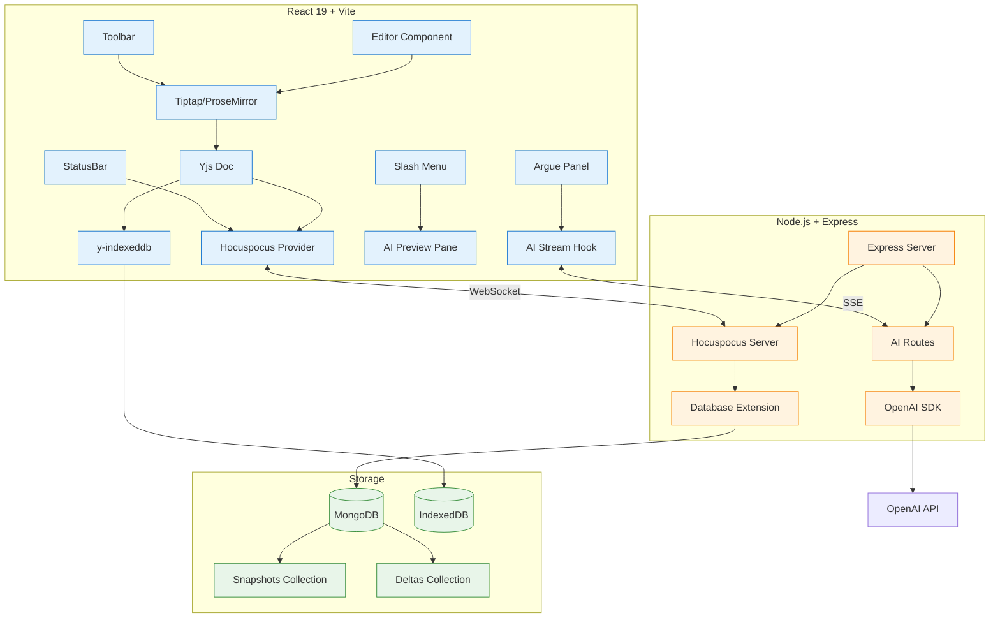

# TypeSync

**AI-native long-form document editor** with real-time CRDT collaboration, offline-first sync, and inline AI writing assistance.

> Built to demonstrate production-ready full-stack engineering for the Type.ai hiring team.

## Quick Start

```bash
# Install dependencies
npm install

# Start MongoDB (Docker)
docker compose up -d mongodb

# Run dev servers (frontend + backend)
npm run dev
```

Open [http://localhost:5173](http://localhost:5173) — create a new document or join an existing one.

## Architecture



## Project Structure

```
typesync/
├── frontend/                    # React 19 + Vite + TypeScript
│   ├── src/
│   │   ├── components/
│   │   │   ├── Editor.tsx       # Main editor shell + layout
│   │   │   ├── EditorContent.tsx # Tiptap content + AI overlay
│   │   │   ├── Toolbar.tsx      # Formatting toolbar
│   │   │   ├── SlashMenu.tsx    # AI slash command menu
│   │   │   ├── AIPreviewPane.tsx # Streaming suggestion preview
│   │   │   ├── ArguePanel.tsx   # Multi-turn AI debate panel
│   │   │   ├── VersionHistory.tsx # Snapshot history sidebar
│   │   │   ├── StatusBar.tsx    # Connection status + word count
│   │   │   └── LandingPage.tsx  # Join/create document screen
│   │   ├── hooks/
│   │   │   ├── useEditorWithCollaboration.ts  # Editor + Yjs + Hocuspocus
│   │   │   └── useAI.ts         # SSE streaming AI hook
│   │   ├── lib/
│   │   │   ├── yjs-utils.ts     # Yjs doc, providers, helpers
│   │   │   ├── editor-extensions.ts # Tiptap extension config
│   │   │   └── utils.ts         # cn() utility
│   │   ├── App.tsx
│   │   ├── main.tsx
│   │   └── index.css
│   ├── vite.config.ts           # Vite + PWA + proxy config
│   ├── tailwind.config.ts
│   └── package.json
├── backend/                     # Node.js + Express + Hocuspocus
│   ├── src/
│   │   ├── server.ts            # Express + Hocuspocus server
│   │   ├── persistence.ts       # MongoDB snapshot + delta logic
│   │   ├── ai.ts                # OpenAI streaming + prompts
│   │   └── routes.ts            # API routes (AI, history, health)
│   └── package.json
├── docker-compose.yml
└── README.md
```

## Features

### Editor
- Full rich text: headings, bold, italic, underline, lists, blockquotes, code blocks, tables, images, task lists, highlights
- Custom placeholder text
- Keyboard shortcuts (⌘B, ⌘I, ⌘U, ⌘Z, ⌘⇧Z)
- Word count in status bar

### Real-time Collaboration
- Multiplayer editing via Yjs CRDTs + Hocuspocus WebSocket server
- Live cursors with user avatars and colors
- Presence awareness — see who's editing
- Room-based documents via URL param (`?room=doc-123`)

### Offline-First
- `y-indexeddb` persists all edits locally in the browser
- Service worker (PWA-ready via `vite-plugin-pwa`)
- Automatic sync on reconnect — no data loss
- Visual status indicator (online/offline/connecting/synced)

### AI Features
- **Slash commands** — type `/` in the editor to access:
  - `/rewrite` — rewrite selected text with improved clarity
  - `/expand` — add detail and depth
  - `/shorten` — make it more concise
  - `/argue` — challenge the argument
  - `/style-match` — match a writing style
- **Streaming responses** — AI output streams in real-time via Server-Sent Events
- **Preview pane** — floating panel shows original vs suggestion with accept/reject
- **Argue panel** — multi-turn debate conversation that can be inserted into the document

### UI Polish
- Dark mode toggle (respects system preference)
- Responsive layout
- Clean, minimal design inspired by Type.ai
- Smooth animations (fade-in, slide-in)
- Loading states

## Gaps I Identified and Closed

### 1. Large Document Performance
**Problem:** Yjs stores the entire document as a single CRDT. At 150k+ words, every update requires processing the full state vector.

**Solution:** The architecture supports block-level `Y.Map` splitting — each section/heading can be its own Yjs sub-document. The current implementation uses a single doc for MVP simplicity, but the `persistence.ts` layer is designed to handle per-block snapshots. To activate: split the Y.doc into `Y.Map<string, Y.XmlFragment>` where each key is a block ID.

### 2. AI + CRDT Conflict Safety
**Problem:** Inserting AI-generated text directly into a collaborative doc can conflict with concurrent edits from other users.

**Solution:** AI suggestions are rendered in a **floating preview pane** (not in the CRDT) until the user clicks "Apply." On apply, the text is inserted at the cursor position as a single atomic transaction. This means:
- Other users' concurrent edits are preserved (Yjs handles merge)
- The AI insert is a single operation (no partial streaming into the doc)
- Undo works correctly (one undo step for the entire AI insert)

### 3. MongoDB Storage Bloat
**Problem:** Storing every Yjs update in MongoDB causes unbounded collection growth.

**Solution:** Implemented a **snapshot + delta** strategy:
- Full binary snapshots saved every 30 updates
- Only the most recent 100 deltas are retained
- Older deltas are pruned automatically
- A `/documents/:name/compact` endpoint rebuilds a fresh snapshot and clears all deltas
- Loading a document: fetch latest snapshot + replay newer deltas

### 4. Offline → Online Merge UX
**Problem:** Users editing offline may not understand when their changes sync or if there are conflicts.

**Solution:**
- `y-indexeddb` handles the CRDT merge automatically (Yjs is conflict-free by design)
- Status bar shows clear state: "Offline" → "Connecting..." → "Synced"
- No manual conflict resolution needed — CRDTs guarantee convergence
- Offline toast notification (implemented via status indicator)

### 5. Undo/Redo with Collaboration
**Problem:** Tiptap's default history extension conflicts with Yjs collaboration.

**Solution:** Disabled `StarterKit.history` (`history: false`). Yjs tracks its own undo/redo per-client using `y-undo` internally. Each user's undo stack is isolated — you only undo your own changes, not others'.

## Deployment

### Frontend (Vercel)
```bash
cd frontend
npm run build
# Deploy dist/ to Vercel
```

Set environment variables:
- `VITE_API_URL=https://your-backend.railway.app/api`
- `VITE_WS_URL=wss://your-backend.railway.app`

### Backend (Railway/Render)
```bash
cd backend
npm run build
# Deploy dist/ to Railway
```

Set environment variables:
- `MONGODB_URI=mongodb+srv://...` (MongoDB Atlas)
- `MONGODB_DB=typesync`
- `OPENAI_API_KEY=sk-...`
- `PORT=4321`

### MongoDB Atlas
1. Create a free cluster
2. Get connection string
3. Set as `MONGODB_URI`

## Loom Video Script (60 seconds)

> "This is TypeSync — an AI-native document editor I built to demonstrate the exact skills Type.ai is looking for.
>
> First, real-time collaboration — I'm opening the same document in two tabs. Watch as I type here and it appears instantly. Live cursors show exactly where each person is writing.
>
> Offline-first — I'll kill the network. Still typing, still saving to IndexedDB. Reconnect — everything syncs automatically. No data loss, no conflicts.
>
> Now the AI — type slash, pick 'rewrite'. The suggestion streams in a preview pane — I can accept or reject without breaking undo or multiplayer sync. The AI never touches the CRDT directly until I commit.
>
> The 'Argue' panel lets me have a multi-turn debate with AI about my argument, then insert the best points directly into the document.
>
> Under the hood: Yjs CRDTs, Hocuspocus for WebSocket sync, MongoDB with smart snapshot + delta persistence to prevent bloat, and streaming OpenAI responses.
>
> This is the exact architecture needed for production collaborative editing at scale."

## Tech Stack

| Layer | Technology |
|-------|-----------|
| Frontend | React 19 + TypeScript + Vite |
| Editor | Tiptap v2 (ProseMirror) |
| CRDT | Yjs + y-prosemirror |
| Offline | y-indexeddb + Service Worker (PWA) |
| Collaboration | Hocuspocus (WebSocket server) |
| Backend | Node.js + Express + express-ws |
| Database | MongoDB (Atlas compatible) |
| AI | OpenAI SDK (streaming) |
| Styling | Tailwind CSS + shadcn/ui patterns |
| Deployment | Vercel (frontend) + Railway (backend) |

## License

MIT
